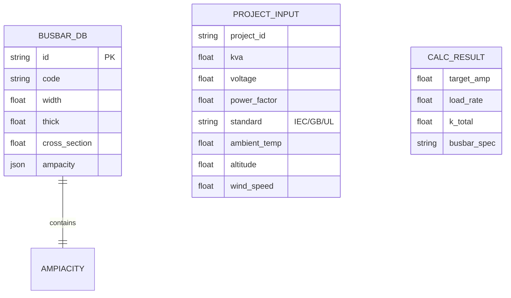
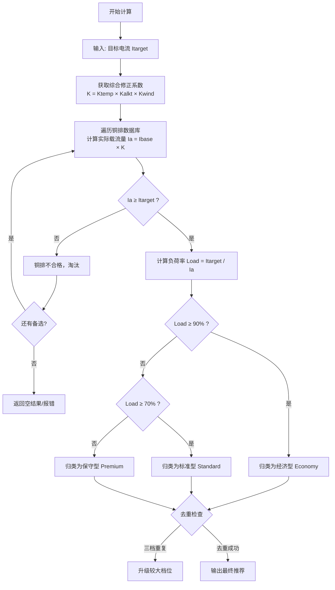
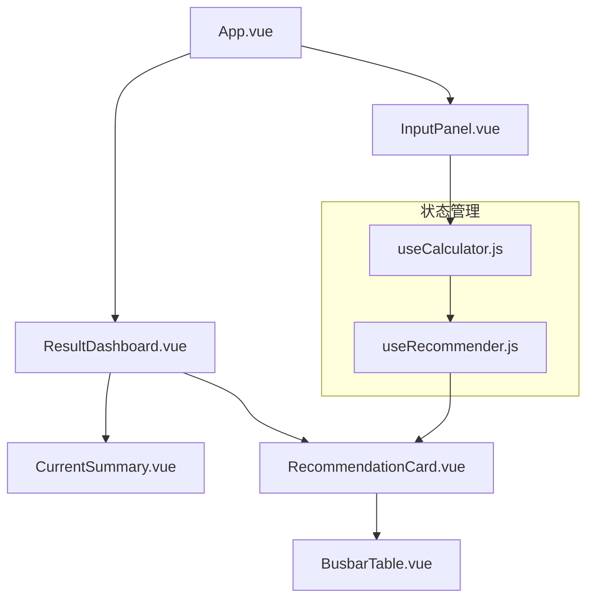
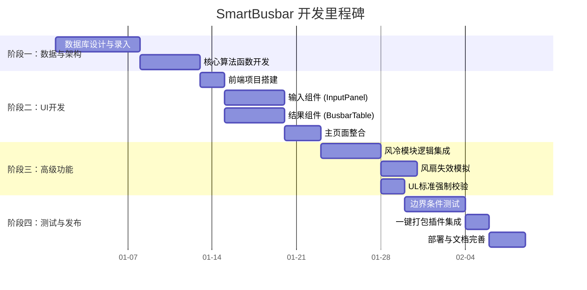

## 🤖 Assistant

# 📋 SmartBusbar - UPS铜排智能选型完整方案

---

> **元数据**
> `title:: SmartBusbar - UPS铜排智能选型完整方案`
> `category:: 产品方案`
> `tags:: [UPS, 电气设计, 铜排选型, 智能工具, 风冷]`
> `author:: 产品经理`
> `date:: 2024-01-01`
> `version:: 1.0`

---

## 🎯 一、项目概述

### 1.1 项目背景
开发一个针对UPS系统的专业铜排选型工具。通过输入UPS参数，自动计算主路、旁路、输出及中性线电流，并结合环境因素（温度、海拔、风冷）推荐三组不同规格的铜排方案。

### 1.2 核心价值
| 价值维度 | 描述 |
| :--- | :--- |
| **自动化** | 将繁琐的手工查表计算自动化，提升效率 |
| **场景化** | 支持风冷、环境、谐波等多维度场景修正 |
| **决策支持** | 提供经济型、标准型、保守型三档方案，辅助决策 |
| **知识沉淀** | 将电气选型经验转化为可复用工具 |

### 1.3 目标用户
- 电气设计工程师
- UPS售前技术支持
- 数据中心基础设施规划师
- 配电柜成套厂技术员

---

## 🔧 二、基础计算逻辑

### 2.1 输入参数定义

| 参数 | 符号 | 单位 | 默认值 | 说明 |
| :--- | :--- | :--- | :--- | :--- |
| UPS容量 | $S$ | kVA | 100 | 设备额定功率 |
| 系统电压 | $U$ | V | 400 | 通常为400V三相 |
| 功率因数 | $PF$ | - | 0.9 | 设备输出功率因数 |
| 主路系数 | $K_{mains}$ | - | 1.3 | 包含效率损耗与充电电流 |
| N线系数 | $K_n$ | - | 1.0/2.0 | 标准/高谐波场景 |

> [!NOTE]
> **主路系数说明**：主路电流 = 负载电流 + 效率损耗 + 电池充电电流。工程上通常按 **1.3倍** 满载输出电流估算。

### 2.2 核心公式

#### 2.2.1 输出回路电流 ($I_{out}$)
$$I_{out} = \frac{S \times 1000}{\sqrt{3} \times U}$$

#### 2.2.2 旁路回路电流 ($I_{bypass}$)
$$I_{bypass} = I_{out} \times 1.1$$
> 旁路通常需承担110%的过载能力。

#### 2.2.3 主路输入电流 ($I_{mains}$)
$$I_{mains} = \frac{I_{out}}{\eta} + I_{charge}$$
> **工程简化公式**：$I_{mains} \approx I_{out} \times 1.3$

#### 2.2.4 中性线电流 ($I_{neutral}$)
$$I_{neutral} = I_{out} \times K_n$$
- **标准负载**：$K_n = 1.0$ (100% 截面)
- **高谐波负载**：$K_n = 2.0$ (200% 截面，防止零线过热)

---

## 🗄️ 三、数据架构设计

### 3.1 铜排基础数据库 (busbar_data.js)

```javascript
// 铜排规格基础数据
export const BUSBAR_DB = [
  {
    "id": "tm_15_3_tin_1",
    "code": "TMY-15x3",
    "width": 15,           // 宽度 mm
    "thick": 3,            // 厚度 mm
    "cross_section": 45,   // 截面积 mm²
    "standard": ["GB", "IEC"],
    // 载流量字典: [材质][片数] = 额定电流(A)
    "ampacity": {
      "bare":  { "1": 162, "2": 285, "3": 370 },
      "tinned": { "1": 184, "2": 315, "3": 410 }
    },
    "weight": 0.40,        // kg/m
    "layers": [1, 2, 3],   // 支持片数
    "short_circuit": 35    // 短路动稳定系数
  },
  {
    "id": "tm_20_3_tin_1",
    "code": "TMY-20x3",
    "width": 20,
    "thick": 3,
    "cross_section": 60,
    "ampacity": {
      "tinned": { "1": 220, "2": 385, "3": 500 }
    },
    "layers": [1, 2, 3]
  },
  {
    "id": "tm_60_10_tin_1",
    "code": "TMY-60x10",
    "width": 60,
    "thick": 10,
    "cross_section": 600,
    "ampacity": {
      "tinned": { "1": 1200, "2": 1900, "3": 2400 }
    },
    "layers": [1, 2, 3]
  }
  // ... 持续扩展至 120x10
];
```

### 3.2 环境修正系数表

```javascript
export const CORRECTION_FACTORS = {
  // 温度修正 (IEC 60587 标准环境35℃为基准)
  "temp": {
    "25": 1.10, "30": 1.06, "35": 1.00,
    "40": 0.94,  "45": 0.87,  "50": 0.82
  },
  // 海拔修正
  "altitude": {
    "1000": 1.00, "2000": 0.95, "3000": 0.90, "4000": 0.85
  },
  // 风速修正 (强迫风冷增益)
  "wind": {
    "0":   1.00,   // 静止空气
    "0.5": 1.12,   // 微风 (~12%增益)
    "1":   1.25,   // 定向风道 (~25%增益)
    "2":   1.45,   // 强迫风冷 (~45%增益)
    "3":   1.60    // 高效风冷 (~60%增益)
  }
};
```

### 3.3 数据模型图



---

## 🧮 四、智能推荐算法

### 4.1 三档策略定义

| 策略 | 代号 | 负荷率范围 | 特点 | 适用场景 |
| :--- | :--- | :--- | :--- | :--- |
| **经济型** | 🟡 Economy | 90% ~ 100% | 温升上限，成本最低 | 预算紧张的商业项目 |
| **标准型** | 🟢 Standard | 70% ~ 90% | **默认推荐**，安全与经济平衡 | 通用工业与数据中心 |
| **保守型** | 🔵 Premium | < 70% | 低温升，预留未来扩容 | 金融级、医疗级关键负载 |

### 4.2 算法流程图



### 4.3 核心代码实现

```javascript
/**
 * 智能推荐算法
 * @param {Number} targetAmp - 目标电流 (A)
 * @param {Object} env - 环境参数
 * @returns {Object} 推荐结果 {economy, standard, premium}
 */
export function recommendBusbar(targetAmp, env) {
  
  // 1. 计算综合修正系数
  const k_temp = CORRECTION_FACTORS.temp[env.temp];
  const k_alt = CORRECTION_FACTORS.altitude[env.altitude];
  
  // ⚠️ UL标准通常禁止风冷修正
  const k_wind = (env.standard === 'UL') ? 
    1.0 : 
    (CORRECTION_FACTORS.wind[env.wind] || 1.0);
  
  const k_total = k_temp * k_alt * k_wind;
  
  // 2. 遍历数据库生成候选集
  let candidates = [];
  
  BUSBAR_DB.forEach(bar => {
    // 处理单片、双片、三片
    bar.layers.forEach(layer => {
      // 优先查镀锡数据，无则查裸铜
      let base = bar.ampacity.tinned?.[layer] || 
                 bar.ampacity.bare?.[layer];
      
      if (!base) return;
      
      let realAmp = Math.floor(base * k_total);
      let loadRate = targetAmp / realAmp;
      
      if (realAmp >= targetAmp) {
        candidates.push({
          id: bar.id,
          name: bar.code,
          layers: layer,
          realAmp,
          loadRate,
          // 规格描述: "TMY-60x10 (2片)"
          displaySpec: `${bar.code} (${layer}片)`
        });
      }
    });
  });
  
  // 3. 筛选、排序、分级
  if (candidates.length === 0) {
    return { error: "未找到符合条件的铜排规格，请降低电流或调整环境参数" };
  }
  
  // 按负荷率降序排序 (经济型在前)
  candidates.sort((a, b) => b.loadRate - a.loadRate);
  
  const economy = candidates.find(c => c.loadRate >= 0.90);
  const standard = candidates.find(c => c.loadRate >= 0.70 && c.loadRate < 0.90);
  const premium = candidates.find(c => c.loadRate < 0.70);
  
  // 4. 去重与回退策略
  const getBest = (curr, fallbackList, excludeId) => {
    if (curr && curr.id !== excludeId) return curr;
    return fallbackList.find(c => c.id !== excludeId) || fallbackList[0];
  };
  
  return {
    economy: getBest(economy, candidates, premium?.id),
    standard: getBest(standard, candidates, economy?.id || premium?.id),
    premium: getBest(premium, candidates, economy?.id || standard?.id)
  };
}
```

---

## 💨 五、风冷热流影响模型

### 5.1 物理原理

引入风速变量后，载流量增益遵循流体力学传热规律。根据 DIN 43671 标准，风速与载流量增益呈非线性关系。

| 风速 (m/s) | 修正系数 $K_{wind}$ | 增益幅度 | 典型应用场景 |
| :--- | :--- | :--- | :--- |
| **0 m/s** | **1.00** | Base | 封闭柜体，自然对流 |
| **0.5 m/s** | **1.12** | +12% | 柜顶小风扇抽风 |
| **1.0 m/s** | **1.25** | +25% | 柜内定向风道 |
| **2.0 m/s** | **1.45** | +45% | 强迫风冷 (常见配置) |
| **3.0 m/s** | **1.60** | +60% | 高效风冷 (噪音较大) |

> [!WARNING]
> **合规风险**：UL标准通常要求在自然对流条件下满足温升要求。**使用风冷修正进行UL设备选型可能导致安规认证失败。**

### 5.2 风冷失效模拟

| 模拟场景 | 修正系数 | 选型结果 | 风险提示 |
| :--- | :--- | :--- | :--- |
| **风扇正常** | $K = 1.45$ | 通过 (如选用60x10) | - |
| **风扇失效** | $K = 1.00$ | 失败 (负荷率 >130%) | ⚠️ 存在烧毁风险 |

> **产品策略**：增加"模拟风扇故障"开关，教育用户风冷选型必须配合**风扇故障报警**或**N+1冗余风扇**。

---

## 🎨 六、UI 交互设计

### 6.1 整体布局 Wireframe

```
┌───────────────────────────────────────────────────────────────────────┐
│  🏢 SmartBusbar V1.0         UPS铜排智能选型工具              [?帮助] │
├─────────────────────────────┬─────────────────────────────────────────┤
│  📝 参数配置                 │  📊 计算结果概览                        │
│                            │                                         │
│  ┌─────────────────────┐   │  ┌─────────────────────────────────┐    │
│  │ UPS容量 (kVA)       │   │  │ 🔌 主路输入: 216 A              │    │
│  │ [  100  ]            │   │  │ 🔌 旁路输入: 166 A              │    │
│  │                     │   │  │ 🔌 输出回路: 144 A              │    │
│  │ 系统电压 (V)        │   │  │ 🔌 N排回路: 288 A (200%)        │    │
│  │ [ 400  ]             │   │  └─────────────────────────────────┘    │
│  │                     │   │                                         │
│  │ 系统标准            │   │  ┌─────────────────────────────────┐    │
│  │ (○) IEC/GB  ( ) UL  │   │  │ 📦 主路铜排推荐 (216A)          │    │
│  │                     │   │  │ ┌───────┬───────┬───────┐      │    │
│  │ 🌡️ 环境温度        │   │  │ │经济型 │标准型 │保守型  │      │    │
│  │ [ 35 ℃  ]           │   │  │ ├───────┼───────┼───────┤      │    │
│  │                     │   │  │ │60x10  │60x10  │80x10   │      │    │
│  │ 🏔️ 海拔高度        │   │  │ │ 1片    │ 1片    │ 2片    │      │    │
│  │ [ 1000 m ]          │   │  │ │ 260A  │ 260A  │ 380A   │      │    │
│  │                     │   │  │ │ 83%   │ 83%   │ 57%    │      │    │
│  │ 🌀 散热方式        │   │  │ └───────┴───────┴───────┘      │    │
│  │ (○) 自然  (●) 强迫 │   │  └─────────────────────────────────┘    │
│  │                     │   │                                         │
│  │ 风速 [ 2.0 m/s ] ───│───│──> ⚡预计载流提升: +45%              │
│  │         ↓           │   │                                         │
│  └─────────────────────┘   └─────────────────────────────────────────┘
└─────────────────────────────┴─────────────────────────────────────────┘
```

### 6.2 Vue 组件结构



### 6.3 核心组件代码示例

#### 6.3.1 InputPanel.vue

```html
<template>
  <el-form :model="form" label-position="top" class="p-4 bg-gray-50 rounded-lg">
    
    <!-- 基本参数 -->
    <el-divider content-position="left">设备参数</el-divider>
    <el-form-item label="UPS容量 (kVA)">
      <el-input-number v-model="form.kva" :min="10" :max="2000" :step="10" />
    </el-form-item>
    
    <el-form-item label="系统电压 (V)">
      <el-select v-model="form.voltage">
        <el-option label="400V (三相)" :value="400" />
        <el-option label="380V (三相)" :value="380" />
        <el-option label="220V (单相)" :value="220" />
      </el-select>
    </el-form-item>
    
    <el-form-item label="适用标准">
      <el-radio-group v-model="form.standard">
        <el-radio label="IEC">IEC/GB (支持风冷)</el-radio>
        <el-radio label="UL">UL (保守计算)</el-radio>
      </el-radio-group>
      <div v-if="form.standard === 'UL'" class="text-xs text-orange-500 mt-1">
        ⚠️ UL标准禁用风冷修正
      </div>
    </el-form-item>
    
    <!-- 环境参数 -->
    <el-divider content-position="left">环境参数</el-divider>
    <el-form-item label="环境温度 (℃)">
      <el-select v-model="form.temp">
        <el-option v-for="t in [25,30,35,40,45,50]" :key="t" :label="t+'℃'" :value="t" />
      </el-select>
    </el-form-item>
    
    <el-form-item label="海拔高度 (m)">
      <el-select v-model="form.altitude">
        <el-option v-for="a in [1000,2000,3000,4000]" :key="a" :label="a+'m'" :value="a" />
      </el-select>
    </el-form-item>
    
    <!-- 风冷参数 -->
    <el-divider content-position="left">散热条件</el-divider>
    <el-form-item label="散热方式">
      <el-radio-group v-model="form.cooling">
        <el-radio label="natural">自然对流 (静止)</el-radio>
        <el-radio label="forced" :disabled="form.standard === 'UL'">
          强迫风冷 (风扇)
        </el-radio>
      </el-radio-group>
    </el-form-item>
    
    <transition name="el-zoom-in-top">
      <el-form-item v-if="form.cooling === 'forced'" label="风速 (m/s)">
        <el-slider 
          v-model="form.wind" 
          :min="0.5" 
          :max="3.0" 
          :step="0.5" 
          show-stops
          class="w-full"
        />
        <div class="flex justify-between text-xs text-blue-600 mt-1">
          <span>+12%</span>
          <span>+25%</span>
          <span>+45%</span>
          <span>+60%</span>
        </div>
        <div class="text-center text-sm font-bold text-blue-700 mt-2">
          预计载流提升: +{{ windBonus }}%
        </div>
      </el-form-item>
    </transition>
    
  </el-form>
</template>

<script setup>
import { computed } from 'vue';
import { CORRECTION_FACTORS } from '@/constants';

const props = defineProps(['modelValue']);
const emit = defineEmits(['update:modelValue']);

const form = computed({
  get: () => props.modelValue,
  set: (val) => emit('update:modelValue', val)
});

// 风速增益百分比
const windBonus = computed(() => {
  const k = CORRECTION_FACTORS.wind[form.value.wind] || 1.0;
  return Math.round((k - 1) * 100);
});
</script>
```

#### 6.3.2 BusbarTable.vue (智能选型结果展示)

```html
<template>
  <el-table :data="recommendations" stripe class="w-full">
    
    <el-table-column label="推荐策略" width="100" align="center">
      <template #default="{ row }">
        <el-tag :type="row.strategyColor" effect="dark">
          {{ row.strategyName }}
        </el-tag>
      </template>
    </el-table-column>
    
    <el-table-column prop="spec" label="铜排规格" align="center" />
    
    <el-table-column prop="layers" label="片数" width="80" align="center" />
    
    <el-table-column prop="realAmp" label="载流量 (A)" width="100" align="center" />
    
    <el-table-column label="负荷率" align="center">
      <template #default="{ row }">
        <el-progress 
          :percentage="Math.round(row.loadRate * 100)"
          :color="getProgressColor(row.loadRate)"
          :stroke-width="20"
          :show-text="false"
        />
        <span class="text-xs ml-2">{{ Math.round(row.loadRate * 100) }}%</span>
      </template>
    </el-table-column>
    
    <el-table-column label="操作" width="80" align="center">
      <template #default="{ row }">
        <el-button 
          v-if="row.isDefault" 
          type="primary" 
          size="small"
          @click="copySpec(row)"
        >
          推荐
        </el-button>
      </template>
    </el-table-column>
    
  </el-table>
</template>

<script setup>
const props = defineProps(['data']);

const getProgressColor = (rate) => {
  if (rate > 0.90) return '#F56C6C'; // 红色-过热
  if (rate > 0.70) return '#E6A23C'; // 橙色-偏热
  return '#67C23A';                  // 绿色-安全
};

const copySpec = (row) => {
  // 复制到剪贴板逻辑
  navigator.clipboard.writeText(`主路推荐: ${row.spec} (${row.layers}片), 载流${row.realAmp}A`);
  ElMessage.success('已复制规格说明');
};
</script>
```

---

## 🚀 七、实施计划

### 7.1 开发路线图



### 7.2 技术栈选型

| 类别 | 工具/框架 | 选型理由 |
| :--- | :--- | :--- |
| 构建工具 | **Vite** | 开发体验极佳，启动速度快 |
| 核心框架 | **Vue 3** | Composition API 逻辑复用性强 |
| UI组件库 | **Element Plus** | 丰富的Form/Table/Progress组件 |
| CSS框架 | **Tailwind CSS** | 原子化类名，快速构建响应式布局 |
| 打包策略 | **vite-plugin-singlefile** | 单HTML文件输出，便于离线分发 |

---

## ⚠️ 八、风险与合规声明

### 8.1 法律免责声明

> **重要提示**
> 本工具计算结果基于标准公式和经验系数，仅供参考。最终选型请以：
> 1. **设计院正式图纸**
> 2. **当地电网及消防规范**
> 3. **设备厂商技术手册**
> 为准。作者不承担任何因选型错误导致的经济损失或安全事故责任。

### 8.2 技术风险点与应对

| 风险点 | 风险等级 | 应对措施 |
| :--- | :--- | :--- |
| 风冷失效导致铜排过热 | 🔴 高 | 增加"风扇失效模拟"功能，红色警示 |
| UL标准误用风冷修正 | 🔴 高 | 前端强制校验：选UL时风冷系数锁定为1.0 |
| 谐波导致N线过热 | 🟡 中 | 默认推荐N线200%截面，可手动切换 |
| 大电流双拼载流量计算偏差 | 🟡 中 | 数据库预置双拼载流量数据 |
| 压降不满足规范 | 🟢 低 | 结果增加压降估算提示 (预留扩展) |

---

## 📚 附录

### A. 常用铜排载流量速查 (35℃, 镀锡, 单片)

| 规格 | 载流量 (A) | 规格 | 载流量 (A) | 规格 | 载流量 (A) |
| :--- | :--- | :--- | :--- | :--- | :--- |
| TMY-15x3 | 184 | TMY-40x5 | 650 | TMY-80x10 | 1500 |
| TMY-20x3 | 220 | TMY-50x5 | 780 | TMY-100x10 | 1750 |
| TMY-30x3 | 340 | TMY-60x5 | 910 | TMY-120x10 | 2050 |
| TMY-40x3 | 440 | TMY-60x10 | 1200 | - | - |

### B. 参考标准
- IEC 60587: 环境条件对载流量的影响
- DIN 43671: 铜排持续载流量标准
- GB 7251.1: 低压成套开关设备和控制设备

---

> **文档版本**: v1.0
> **最后更新**: 2024-01-01
> **维护者**: 产品经理
