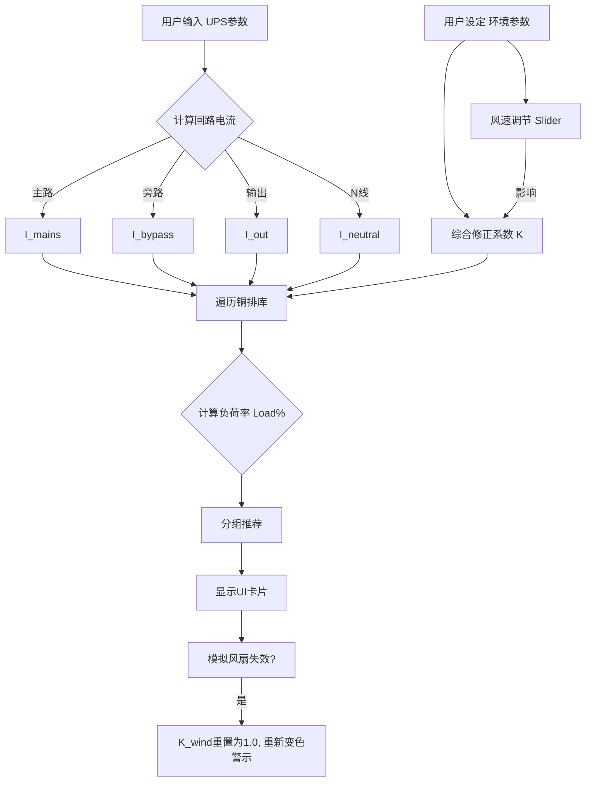

## 🤖 Assistant

这是一个为 **Obsidian** 笔记软件优化的完整实施方案。你可以直接将以下内容复制到 Obsidian 的 `.md` 文件中，它包含了 **Callout（警告/提示框）**、**Mermaid 流程图** 和 **代码块** 格式。

---

# 📁 Project: SmartBusbar UPS 选型专家

---
**Metadata**
- **项目代号**: SmartBusbar-UPS
- **版本**: v1.2 (含风冷修正)
- **状态**: 🟢 规划中
- **负责人**: PM (You)
- **技术栈**: Vue 3, Vite, TailwindCSS
- **核心算法**: DIN 43671 / GB 5585 + 修正系数法

---

## 1. 🎯 产品愿景 (Executive Summary)

打造一款**场景化、智能化**的 UPS 铜排选型工具。不同于传统的“查表器”，本工具基于 UPS 设备特性，自动计算主路、旁路、输出及 N 线电流，并引入**风速（Air Velocity）**作为核心变量，为电气工程师提供**经济型、标准型、保守型**三组动态解决方案。

> [!TIP] 核心价值
> 将复杂的非线性修正逻辑（温度、海拔、风速、集肤效应）封装在后端，前端仅展示直观的“红绿灯”式推荐结果。

---

## 2. 🧮 核心业务逻辑 (Business Logic)

### 2.1 UPS 电流计算模型

| 回路类型 | 符号 | 计算公式 / 逻辑 | 备注 |
| :--- | :--- | :--- | :--- |
| **输出回路** | $I_{out}$ | $\frac{S \times 1000}{\sqrt{3} \times U_{sys}}$ | 纯负载电流 |
| **旁路回路** | $I_{bypass}$ | $I_{out} \times 1.0$ (或 $1.1$) | 旁路通常与输出同规格 |
| **主路输入** | $I_{mains}$ | $\frac{I_{out}}{\eta} + I_{charge}$ | **默认系数建议 1.3倍**，含效率损耗+充电 |
| **N 线回路** | $I_{neutral}$ | $I_{out} \times K_{harmonic}$ | **IT负载选 200%**，普通负载选 100% |

### 2.2 载流量修正算法 (The Algorithm)

最终载流量 ($I_{real}$) 计算公式：

$$I_{real} = I_{base} \times K_{temp} \times K_{alt} \times K_{wind} \times K_{structure}$$

- **$I_{base}$**: 铜排标准载流量（查表得，基准 35℃ 静止空气）。
- **$K_{temp}$**: 环境温度修正系数（温度越高，系数越小）。
- **$K_{alt}$**: 海拔修正系数（空气稀薄散热差）。
- **$K_{wind}$**: **风冷增益系数** (本次新增核心)。
- **$K_{structure}$**: 结构系数（双拼/三拼时的集肤效应与邻近效应，通常双拼取 1.8倍而非2.0倍）。

### 2.3 风冷修正模型 (Air Velocity Model)

基于工程经验与 DIN 标准拟合：

| 风速 (m/s) | $K_{wind}$ 系数 | 场景描述 |
| :--- | :---: | :--- |
| **0** | **1.00** | 自然对流 (基准) |
| **0.5** | **1.12** | 柜顶排风，微弱气流 |
| **1.0** | **1.25** | 定向风道 |
| **2.0** | **1.45** | 强迫风冷 (推荐上限) |
| **3.0+** | **1.60** | 极速 (收益递减，噪音大) |

> [!WARNING] 风险提示
> 启用风冷计算时，必须在 UI 上显著警示：**“依赖风扇散热，需确保风扇冗余设计”**。

---

## 3. 🧠 推荐策略引擎 (Recommendation Engine)

针对计算出的目标电流 ($I_{target}$)，系统自动筛选并输出三组方案：

1. **💰 经济型 (Economy)**
 * **逻辑**: $1.0 \le \frac{I_{real}}{I_{target}} \le 1.10$
 * **特征**: 成本最低，温升接近国标上限，利用了风冷极限。
2. **🛡️ 标准型 (Standard) - [Default]**
 * **逻辑**: $1.15 \le \frac{I_{real}}{I_{target}} \le 1.30$
 * **特征**: 工程最佳实践，兼顾成本与安全余量。
3. **💎 保守型 (Premium)**
 * **逻辑**: $\frac{I_{real}}{I_{target}} \ge 1.50$
 * **特征**: 极低温升，适合扩容预留或高可靠性数据中心。

---

## 4. 💾 数据结构设计 (Data Schema)

建议使用 JSON 存储核心数据库 (`db.json`)。

```json
{
  "correction_factors": {
    "temp": { "30": 1.06, "35": 1.0, "40": 0.94, "45": 0.88, "50": 0.82 },
    "altitude": { "1000": 1.0, "2000": 0.95, "3000": 0.90 },
    "wind": { "0": 1.0, "0.5": 1.12, "1.0": 1.25, "2.0": 1.45, "3.0": 1.60 }
  },
  "busbars": [
    {
      "id": "tmy_60_10",
      "w": 60,
      "t": 10,
      "base_amp": {
        "1": 980,  // 单片载流
        "2": 1750, // 双片载流 (已含结构折减)
        "3": 2400  // 三片载流
      }
    }
    // ...更多规格
  ]
}
```

---

## 5. 💻 交互流程设计 (UI/UX)

使用 Mermaid 绘制逻辑流程：



### 5.1 界面布局 (Layout)

* **左侧：控制面板**
 * UPS容量 (Input Number)
 * 主路系数 (默认1.3)
 * N线倍率 (Radio: 100% / 200%)
 * **风冷设置 (Switch + Slider)**: 开启后显示动态风扇图标 🌀。
* **右侧：推荐仪表盘**
 * **Main Input Card**: 显示 3 个 Tab (经济/标准/保守)。
 * **Bypass Card**: 同上。
 * **Output Card**: 同上。
 * **Neutral Card**: 同上。

---

## 6. 📅 实施路线图 (Roadmap)

### Phase 1: 数据准备 (Week 1)
- [ ] 整理 `15x3` 到 `120x10` 全系列铜排载流量表 (基于 GB/IEC)。
- [ ] 录入双拼、三拼的结构系数（集肤效应数据）。
- [ ] 验证风速修正系数的来源可靠性 (DIN 43671)。

### Phase 2: 核心开发 (Week 2-3)
- [ ] 初始化 Vue3 + Vite 项目。
- [ ] 编写 `useUPSCalculator` Hook (处理 UPS 电流)。
- [ ] 编写 `useBusbarSelector` Hook (处理筛选、风速修正)。
- [ ] **单元测试**: 输入 500kVA, 2m/s 风速，验证是否推荐小规格铜排。

### Phase 3: UI 与 体验 (Week 3)
- [ ] 实现风速滑块与动态图标。
- [ ] 开发“风扇失效模拟”的一键切换功能（从有风切换到无风，UI 变红）。
- [ ] 增加“复制方案到剪贴板”功能。

### Phase 4: 部署与交付 (Week 4)
- [ ] 编译为静态页面。
- [ ] 编写使用说明书 (含免责声明)。

---

## 7. 🛡️ 风险控制 (Risk Management)

> [!DANGER] 关键安全检查点
> 1. **UL 标准冲突**: 若用户选择 UL 标准，强制禁用风冷增益功能（或弹出强警告），因为 UL891 通常不认可未经测试的风冷数据。
> 2. **N 线过热**: 对于数据中心场景，默认将 N 线电流设为 输出电流的 **1.732倍 ~ 2倍**，防止三次谐波导致零线烧断。
> 3. **最小截面限制**: 即使计算电流很小，对于大功率 UPS，也应设置最小铜排物理尺寸限制，以满足短路动稳定要求。

---
